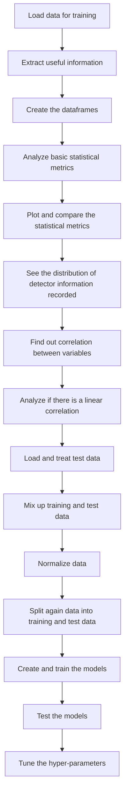

# RPT-SAS-Particle-Path

This repository contains the data treatment, data analysis, data visualization, machine learning models development, and hyper-parameter tunning.

----

**Table of Contents**

* **RPT-SAS-data-analysis.ipynb** is the jupyter notebook with the data treatment, data analysis, data visualization, machine learning models development. 

* **RPT_SAS_tunning.ipynb** is the jupyter notebook with the hyper-parameter tunning.  

### Data 

----
- The data comes from the following repository: https://github.com/sebassaras02/RPT_array_pos.git
 
- The data has five folders (Det-i). Each folder is a different experiment. The entire folder (Det-i) was used in the training stage. The folder Test_RPT was used for the testing. The test dataset was not used in any stage during the train.

----

### Models built
- Two models were built to reconstruct the particle trajectory. They were a Feedforward neural network and a K-Nearest Neighbors. 
- Both models were built for each experimentation.

### Warning
---

The tunning was only a test. It was not the scope of the publication "SAS GEANT4 Application and Machine Learning Algorithms for Radioactive Particle Tracking".

### Model results
---

The best models were obtained with the experimentation with the detector array #3 (Det-3) folder. 
The metrics used to measure the performance were Mean Euclidean Distance Error (MEDE) and Mean Absolute Error (MAE) for each axis. 
The MEDE score was roughly 0.22 for K-Nearest Neighbor Regressor and the Feed Forward Neural Network. Both algorithms got almost the same performance. 
                
### FlowChart of the Model Construction
---

### Contacts:
---
- [Twitter](https://twitter.com/sarasti_seb)
- [LinkedIn](https://linkedin.com/in/sebastiansarasti)
- [ResearchGate](https://www.researchgate.net/profile/Sebastian-Sarasti-2)
